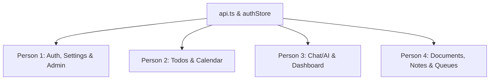

# Frontend-Backend Integration Plan (4-Person Split)

This document outlines a parallel development strategy to connect the Next.js frontend to the FastAPI/backend services. The workload is distributed among **4 developers** with strict directory boundaries to minimize overlap and prevent Git merge conflicts.

---

## 🛠️ Conflict Prevention & Integration Rules

To ensure developers can work concurrently without blocking each other or causing merge conflicts, the following rules must be observed:

1. **Strict Folder Ownership**: Developers must restrict their modifications to their assigned folders under `src/app/` and `src/components/`.
2. **Decoupled Types**: Avoid editing the shared `src/types/index.ts` file. Instead, create feature-specific type files (e.g., `src/types/notes.ts`, `src/types/todo.ts`) in their respective directories or as separate files in `src/types/`.
3. **Decoupled State**: Keep state stores separate. Do not combine them into a single global store. Use Zustand store files or React Context wrappers in the feature folder.
4. **Pre-configured Axios Client**: The base HTTP client is located in `src/lib/api.ts`.
   - **Person 1** owns this file for configuring global interceptors (like authorization headers and automatic token refresh).
   - **Persons 2, 3, and 4** should import this configured client (`import api from "@/lib/api"`) and must **not** modify `src/lib/api.ts` directly.
5. **No Shared Sidebar/Navbar Mutations**: The navigation layout (`src/components/sidebar.tsx` and `src/components/NavBar.tsx`) is already fully functional. If routes need to be modified, Person 1 (Auth/Admin) will coordinate the layout change.

---

## 👥 Task Split Allocation

### 🧑‍💻 Person 1: Authentication, Profiles & Administration
This role manages user access control, profile updates, settings, and administration dashboards.

* **Assigned Directories & Files**:
  * `src/app/auth/` (Login & registration pages)
  * `src/app/profile/` (User profile page)
  * `src/app/settings/` (Theme management, settings page)
  * `src/components/settings/` (Theme toggles, avatar uploads)
  * `src/app/admin/` (User tables, accounts administration, CSV upload)
  * `src/store/authStore.ts` (Zustand state for user auth sessions)
  * `src/lib/api.ts` (Axios interceptor for tokens)
* **Integration Tasks**:
  * Connect login/register pages to authentication endpoints (`/api/v1/auth/login`, `/api/v1/auth/register`).
  * Wire up the token refresh mechanism in `src/lib/api.ts` Response Interceptor.
  * Integrate User Settings and Profile endpoints, including avatar upload (`/api/v1/profile/avatar`).
  * Connect the Admin modules: get user listing, modify accounts, and handle CSV upload parsing/posting (`/api/v1/admin/users`, `/api/v1/admin/csv-upload`).

---

### 🧑‍💻 Person 2: Tasks/Todos & Calendar
This role covers todo list interactions, subtask toggle functionality, task management filtering, and calendar grid events integration.

* **Assigned Directories & Files**:
  * `src/app/todos/` (Main todos view)
  * `src/components/todos/` (Task cards, creation modals, local store, priority configurations)
  * `src/app/calendar/` (Calendar view & grid rendering)
  * `src/lib/calendarUtils.ts` (Date & event rendering logic)
  * `src/store/tasksContext.tsx` & `src/hooks/useTodos.ts`
* **Integration Tasks**:
  * Replace the local storage mock inside `src/components/todos/taskStore.ts` with API calls:
    * `GET /api/v1/tasks` (Load tasks list)
    * `POST /api/v1/tasks` (Create new task)
    * `PATCH /api/v1/tasks/{id}` (Update task / mark subtask done)
    * `DELETE /api/v1/tasks/{id}` (Delete task)
  * Integrate Calendar page with backend calendar events API (`GET /api/v1/calendar/events`). Sync calendar display with tasks that have `dueDate` values.

---

### 🧑‍💻 Person 3: Chat / AI Assistant & Dashboard
This role is responsible for AI assistant chat rooms, message streaming, and orchestrating/wiring up the widgets on the dashboard page.

* **Assigned Directories & Files**:
  * `src/app/chat/` (Chat default page & routes)
  * `src/components/chat/` (AIMessage, StreamingMessage, chatinput, newchatbutton components)
  * `src/hooks/useChat.ts` & `src/store/chatStore.ts`
  * `src/app/dashboard/` (Dashboard view)
  * `src/components/dashboard/` (All widgets: FocusTimer, ActivityFeed, CalendarWidget, DocsWidget, FocusTimer, NotesWidget, ProductivityChart, StatsBar, TasksWidget)
  * `src/app/api/chat/route.ts`
* **Integration Tasks**:
  * Connect the AI chat hook (`useChat.ts`) to stream token-by-token responses from the backend assistant endpoint (`/api/v1/chat/stream`).
  * Fetch and render chat history sessions (`GET /api/v1/chat/sessions`).
  * Wire up the widgets on the Dashboard page. Use hooks exposed by other developers (e.g., `useTodos` from Person 2, and Notes/Docs from Person 4) to populate widget summaries (Tasks count, recent activity, recent notes, focus timer history).

---

### 🧑‍💻 Person 4: Documents, Notes, Polls & Queues
This role focuses on unstructured/structured content hubs (docs, notes) and collaborative utilities (polls, task execution queues).

* **Assigned Directories & Files**:
  * `src/app/documents/` (Documents browse page)
  * `src/components/documents/` (DocumentBrowser, folder hierarchy)
  * `src/app/notes/` (Rich notes page)
  * `src/app/poll/` (Real-time polling widget)
  * `src/app/queues/` (Job execution queues)
  * `src/types/document.ts`
* **Integration Tasks**:
  * Connect document browsing and folders structure to document upload/fetching APIs (`/api/v1/documents`).
  * Connect Notes module to notes CRUD APIs (`GET/POST/PUT/DELETE /api/v1/notes`).
  * Connect Polls module to active poll stats and submission APIs (`/api/v1/polls`).
  * Connect Queues dashboard to backend job processing logs/stats APIs (`/api/v1/queues`).

---

